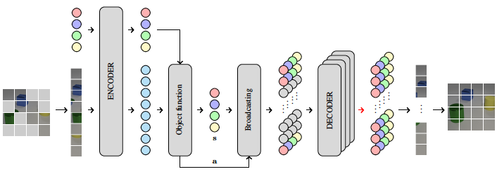
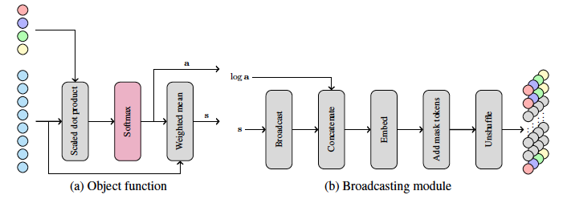

# Learning Explicit Object-Centric Representations with Vision Transformers

Reference code for the paper [Learning Explicit Object-Centric Representations with Vision Transformers](https://arxiv.org/abs/2210.14139) by Oscar Vikström and Alexander Ilin.




The code for the model is implemented as a modification of the code for [MAE](https://github.com/facebookresearch/mae) which is licensed under CC-BY-NC 4.0. 

Contact: <oscar.vikstrom98@gmail.com>

## Requirements

The code has been tested with Python 3.8.5. Package requirements can be found in the `requirements.txt` file and can be installed by running the following:

```sh
pip install -r requirements.txt
```

## Data

We use the processed versions of Tetrominoes, multi-dSprites and CLEVR6 from [Deepmind](https://github.com/deepmind/multi_object_datasets) provided with the [EfficientMORL](https://github.com/pemami4911/EfficientMORL) github repository found [here](https://zenodo.org/record/4895643). For the `.h5` files we use the dataset code form [EfficientMORL](https://github.com/pemami4911/EfficientMORL). The ClevrTex data was downloaded from the following [link](https://www.robots.ox.ac.uk/~vgg/data/clevrtex/) and we use the data loading logic from [clevrtex-generation](https://github.com/karazijal/clevrtex-generation). 

The resulting files were put in folder named `data/`, resulting in the following structure. For running the scripts without modifications, the same structure is expected.

```
└── objectViTAE
    ├── data
    │   ├── clevr6_test.h5
    │   ├── clevr6_train.h5
    │   ├── clevrtex_camo
    │   ├── clevrtex_full
    │   ├── clevrtex_outd
    │   ├── multi_dsprites_test.h5
    │   ├── multi_dsprites_train.h5
    │   ├── tetrominoes_test.h5
    │   └── tetrominoes_train.h5
```

## Experiments

This section describes how to run model training and evalaution for the datasets described above. Note that as a result from cleaning up the code and fixing a couple of things, the experiments should now be quicker to do then when the paper was written.

### Training

The following includes commands for running the training on Tetrominoes, multi-dSprites, CLEVR6 and ClevrTex. Please note, as seen in the paper also, the training on ClevrTex is still very unstable across seeds.

<details><summary>Tetrominoes</summary>

```sh
python train.py --dataset tetrominoes --model_id base-0 --seed 19177  --batch_size 128 --patch_size 5 --init_mask_ratio 0.75 \
      --embed_dim 192 --decoder_embed_dim 128 --num_heads 4 --decoder_num_heads 4 --num_slots 4 
```
</details>

<details><summary>Multi-dSprites</summary>

```sh
python train.py --dataset multi_dsprites --model_id base-0 --seed 59384 --batch_size 128 --patch_size 8 --init_mask_ratio 0.5 \
      --embed_dim 384 --decoder_embed_dim 256 --num_heads 8 --decoder_num_heads 8 --num_slots 6 
```
</details>

<details><summary>CLEVR6</summary>

```sh
python train.py --dataset clevr6 --model_id base-0 --seed 69165 --batch_size 128 --patch_size 16 --init_mask_ratio 0.75 \
      --embed_dim 768 --decoder_embed_dim 512 --num_heads 16 --decoder_num_heads 16 --num_slots 7 
```
</details>

<details><summary>ClevrTex</summary>

```sh
python train.py --dataset clevrtex --model_id base-0 --seed 66740 --batch_size 128 --epochs 300 --patch_size 16 --init_mask_ratio 0.75 \
      --init_noise_scale 0.1 --depth 4 --decoder_depth 2 --embed_dim 768 --decoder_embed_dim 512 --num_heads 16 --decoder_num_heads 16 --num_slots 11
```
</details>

### Evaluation

For evaluating a trained model, please use the same model parameters but run the `evaluate.py` script instead. A example of this for Tetrominoes can be seen below.

<details><summary>Evaluate</summary>

```sh
python evaluate.py --dataset tetrominoes --model_id base-0 --seed 19177 --batch_size 128 --patch_size 5 \
      --embed_dim 192 --decoder_embed_dim 128 --num_heads 4 --decoder_num_heads 4 --num_slots 4 
```
</details>

## Credits

In addition to the model, we also we also use thirdparty code for data and evaluation. A list of used resources and their corresponding licenses can be found below. 

- Base for model implementation and position embedding code from [MAE](https://github.com/facebookresearch/mae). License: CC-BY-NC 4.0
- Dataset code for Tetrominoes, Multi-dSprites and CLEVR6  from: [EfficientMORL](https://github.com/pemami4911/EfficientMORL). License: MIT
- Evaluation code and dataset code for ClevrTex from [clevrtex-generation](https://github.com/karazijal/clevrtex-generation). License: BSD 3-Clause
- Model components, optimizer and learning rate scheduler from [`timm==0.5.4`](https://github.com/rwightman/pytorch-image-models). License: Apache-2.0 

The code of these and copies of the licenses can be found in the thirdparty folder of this repository.

## License

The code of this project is made available under CC-BY-NC 4.0. See [LICENSE](./LICENSE) for details.

## Citation 

```
@article{vikstrom2022learning,
  title={Learning Explicit Object-Centric Representations with Vision Transformers},
  author={Vikstr{\"o}m, Oscar and Ilin, Alexander},
  journal={arXiv preprint arXiv:2210.14139},
  year={2022}
}
```